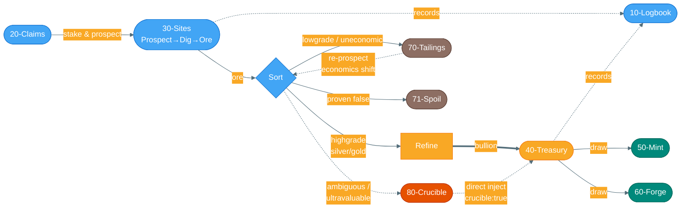
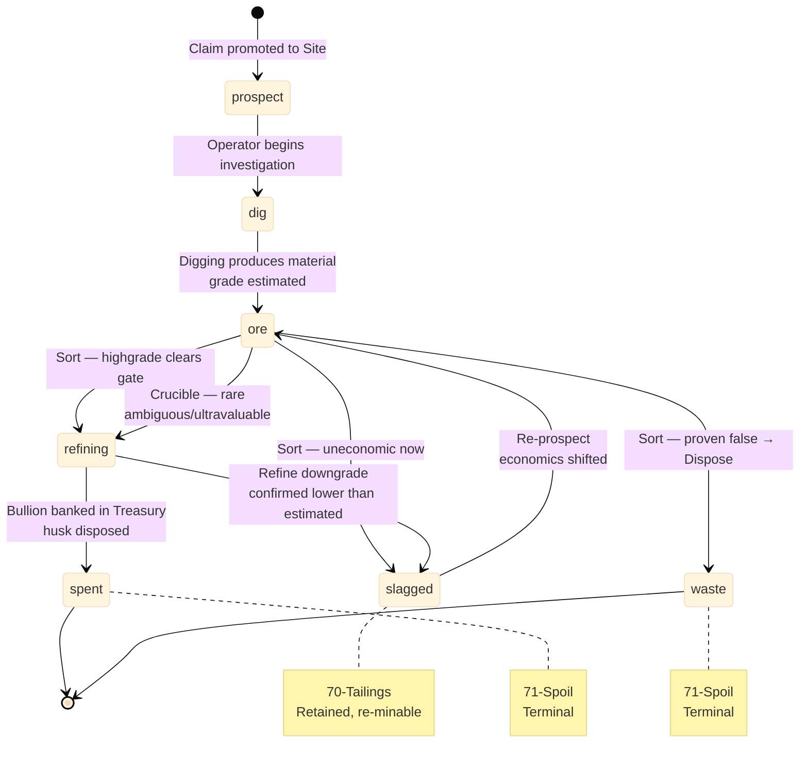
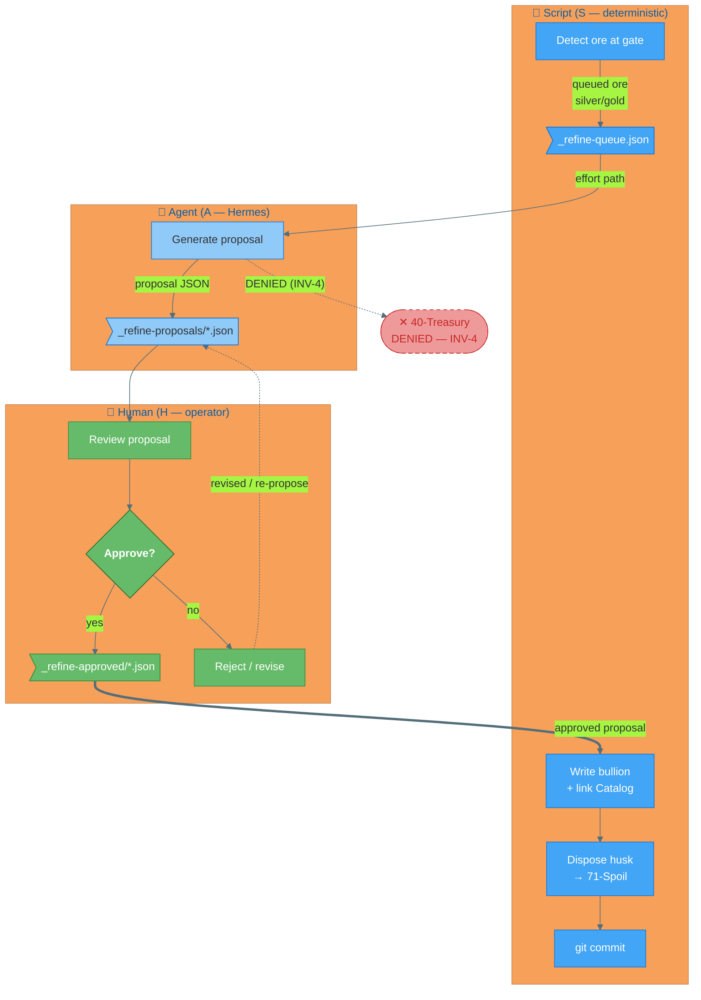
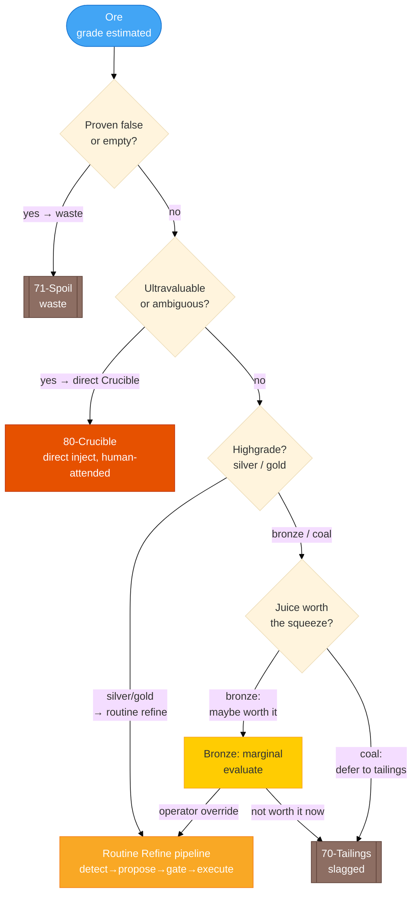
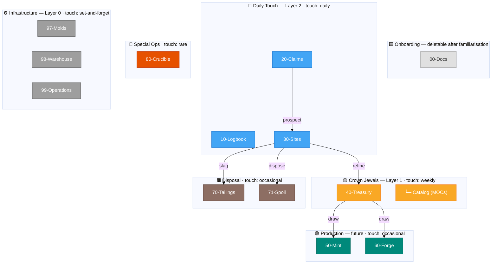
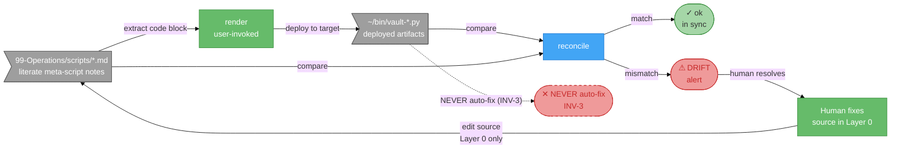
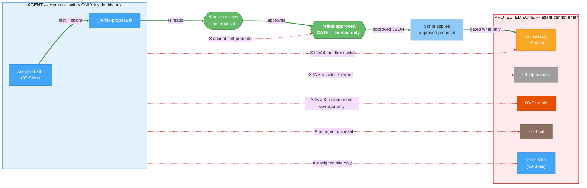

# Value Mining — System Diagrams

Seven Mermaid diagrams covering the full system. Paste any code block into an Obsidian
note wrapped in a ```` ```mermaid ```` fence to render interactively.

**Suggested reading order (first encounter):**
1 Value Chain → 5 Folder Stack → 2 Lifecycle → 4 Sort Router → 3 Refine Pipeline → 7 Containment Boundary → 6 GitOps Loop

Orientation first, structure second, mechanics third, safety and infrastructure last.

---

## Diagram 1: Value Chain Overview

*What is the end-to-end flow of material through the system?*



**Reading guide:**
- Solid arrows → material flow (mandatory path)
- Dashed arrows `-.->` → rare / observing paths
- Thick arrow `==>` → the primary value deposit (ore becomes bullion)
- `10-Logbook` floats parallel, recording without transforming
- `80-Crucible` and `re-prospect` are dashed — rare/exceptional

---

## Diagram 2: Effort Lifecycle

*What states can an effort be in, and what transitions are valid?*



**Reading guide:**
- `slagged` is the only re-entrant state — it can return to `ore` via re-prospect
- `spent` and `waste` are true terminal states (no exit transition)
- `refining` is a process, not a folder — it bridges Sites → Treasury
- Grade values and actor handoff are in Diagrams 3 and 4

---

## Diagram 3: Refine Pipeline (Swimlane)

*Who does what, in what order — and where is the human gate?*



**Reading guide:**
- The `Approve?` gate (green diamond) is the single chokepoint — nothing reaches the Treasury without it
- The red dashed denial node shows the structurally impossible path: agent cannot write directly to Treasury (INV-4)
- Handoff boundaries: Agent→Human = proposal JSON only; Human→Script = approved JSON only
- `git commit` closes every automated mutation (INV-2)

---

## Diagram 4: Sort Router

*How does ore get triaged — what goes where and why?*



**Reading guide:**
- First decision: discard or keep? (proven false → Spoil)
- Second: does it need special handling? (ultravaluable/ambiguous → Crucible)
- Third: grade-gate check (silver/gold auto-refine; coal/bronze need manual decision)
- `Bronze` is the only marginal case — neither auto-refines nor auto-slags; operator decides
- `70-Tailings` and `71-Spoil` shown with double borders — terminal/retained states

---

## Diagram 5: Folder Stack + Layers

*What is the physical folder structure, grouped by layer and ordered by touch frequency?*



**Reading guide:**
- Top-to-bottom = touch frequency order (daily areas first, infrastructure last)
- Folder number prefix = sort order in any file explorer
- Subgraph colour = layer membership
- Spine edges show material flow only; internal detail is in other diagrams
- `00-Docs` is deletable once the operator is familiar

---

## Diagram 6: Layer 0 GitOps Loop

*How does the self-describing Operations layer work?*



**Reading guide:**
- `render` is always user-invoked — no automation deploys to host without a human command
- `reconcile` detects drift; it never overwrites (INV-3)
- The dashed denial node: host artifacts are never authoritative and must never auto-update the source
- The only correction path: human sees DRIFT → edits the Layer-0 source → re-runs `render`

---

## Diagram 7: Containment Boundary

*What can each actor touch, and what paths are structurally impossible?*

This diagram tells the containment story, not the full permission grid. The exhaustive
per-area R/W/— matrix lives in the build PRD §6.1 — this diagram complements it by
making the boundary visible: the agent's reachable set, the single human gate, and the
protected zone it cannot enter.



**Reading guide:**
- **Green thick path** is the only route into the protected zone: assigned Site → proposal → human → gate → script → Treasury. Every link passes through the human.
- **Red thin dashed lines** are not rules the agent follows — they are capabilities it does not have. Each is annotated with the invariant that makes it structurally impossible.
- The agent box (blue tint) and the protected zone (red tint) never touch except through the gate.
- Agent read access (not drawn): R on `10-Logbook`, `70-Tailings`, restricted R on `40-Treasury` during cloud bootstrap. Reads do not threaten containment; writes do.

| Denied path | Invariant |
|---|---|
| Agent → Treasury (write) | INV-4 |
| Agent → Operations | INV-5 |
| Agent → `_refine-approved/` | cannot self-promote |
| Agent → Spoil | no agent disposal |
| Agent → Crucible | INV-8 |
| Agent → other Sites | bounded scope |
